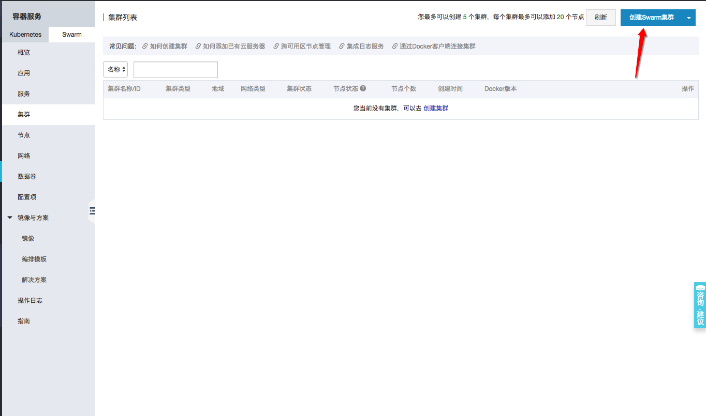
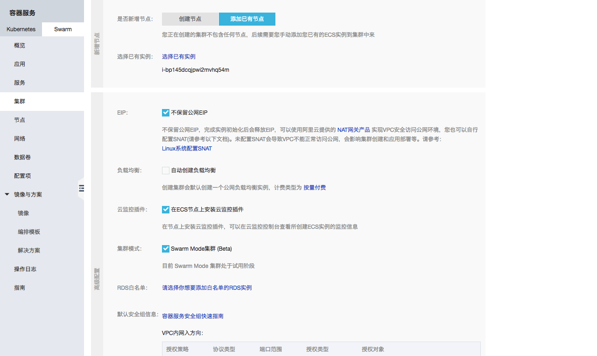

其实论到容器管理我是首推kubernetes的，但是看了下阿里k8s的价格，master最少三个节点，每个节点最低配2核4G，顿时犹豫了，想了想如果项目还处于比较小的起步阶段，先用swarm撑着应该也行。

<!-- more -->

## 创建集群

进到阿里云的`容器服务`控制台，选swarm集群，点创建集群：

然后选一下所在的地域啊专网的路由交换机啊，如果有空着的可用ecs，直接选`添加已有节点`，添加时可以选择`不保留公网EIP`，EIP这个之后自己绑。再往下高级配置上也是勾上`不保留公网EIP`，不要勾`自动创建负载均衡`，这些之后自己配。

稍等一会就可以看到新创建好的集群了，阿里云默认每个用户可以免费创建5个集群，每个集群20个节点：

## 创建应用

集群创建好后需要添加节点(nodes)、创建应用(deployments)及服务(services)，刚刚创建集群的时候默认添加了一个节点，现在先创建一个应用：

注意更新策略选蓝绿发布，这样可以实现不间断更新

aliyun.log_store_dbstdout: stdout 表示将容器的标准写入 logstore acslog-wordpress-dbstdout里。这个标签的格式为 aliyun.log_store_{name}: {logpath}。其中：

name 为阿里云日志服务 logstore 的名字，实际创建的 logstore 的名字为acslog-${app}-${name}。
app 为应用名称。
logpath为容器中日志的路径。
stdout 是一个特殊的 logpath，表示标准输出。
aliyun.log_ttl_<logstore_name> 标签用来设置日志库初始日志保存时间，单位为天，有效值为 1~365 天，不配置则默认初始化为 2 天。

