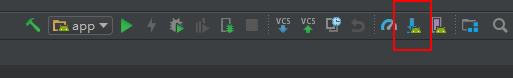
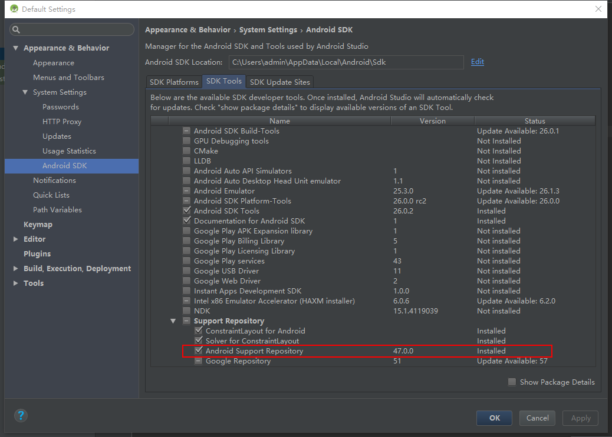
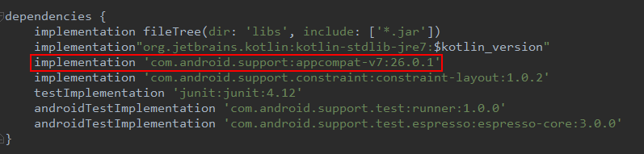

引用支持库。

<!-- more -->

支持库(support library) 很多情况下是为了满足向后兼容性，使用新组建而不用去考虑兼容的版本。
各种支持库可以参考[这里](https://developer.android.com/topic/libraries/support-library/features.html)。
推荐安装v4和v7。

# 安装

首先确保`android support repository`已安装。打开`SDK Manager`，`Tools > Android > SDK Manager`，或点这里：

切到`SDK Tools`tab，确保`Android Support Repository`是勾上的，如果没勾，就下一下。

接下来打开`build.gradle(module)`，里面有几个要注意的项：
- compileSdkVersion: 这个是android studio编译你的工程时所用的sdk版本，如果在android studio里用高于或低于此版本的函数，编辑器本身会报错。
- minSdkVersion：这个是你应用可以跑的最低版本，Google Play store会根据这个版本来判断设备是否可以安装此应用。
- targetSdkVersion: 目标sdk版本，在高于此版本的设备上运行此应用时，设备会根据此版本号自动降级。

再看到dependencies里其实已经包含了v7 appcompat，它一直向后兼容到API 9，v7已经包含了v4，所以不必两个都安，其他support library同理写这就行：

然后同步gradle就可以使用了。