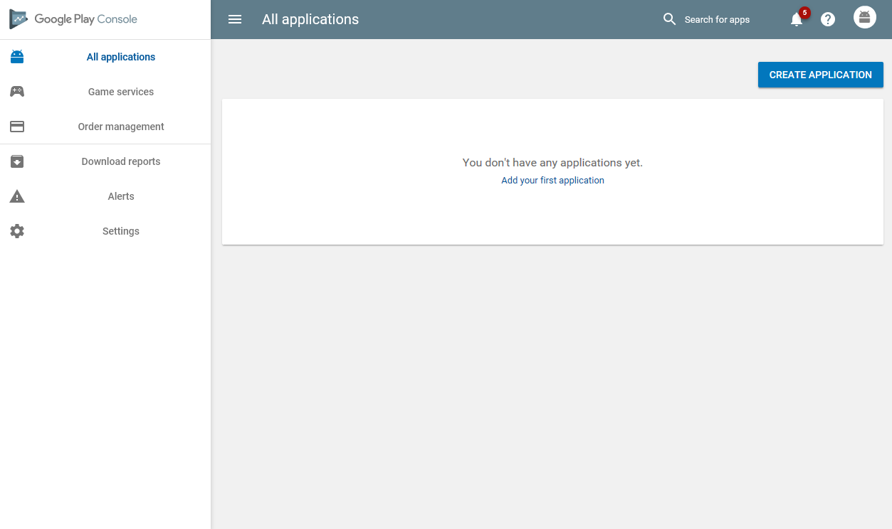
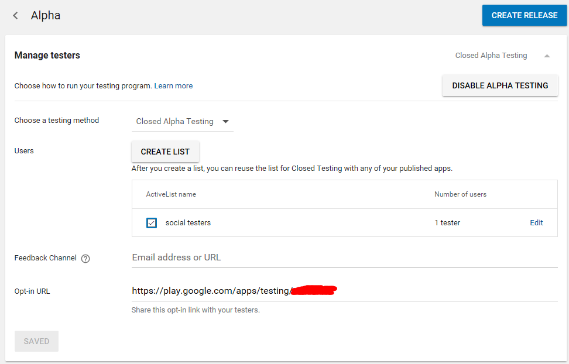
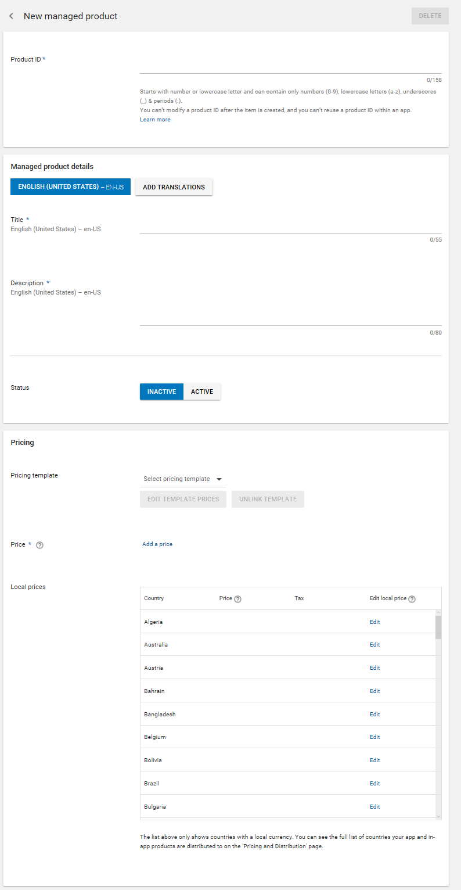
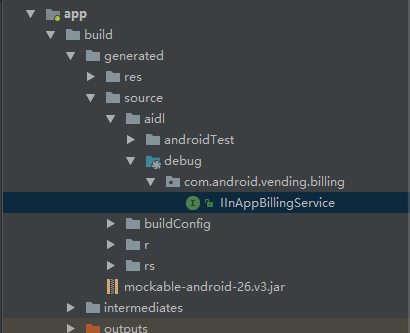

如何在Google Play上上架及谷歌应用内付款接入。 

<!-- more -->

# step1.账号

首先，你需要一个谷歌开发者账号去登录[Google Play Console](https://play.google.com/apps/publish)，如果是付费app或有应用内购买，还需要一个[Google Wallet](https://www.google.com/wallet/)账号。

注册新号时注意，不同IP，不同设备，不同手机号，不同银行卡，不然有可能被捆绑连作。谷歌的开发者账号是25美金一次性开通，终身有效，跟苹果比简直良心~~

# step2.添加新应用

进入console，点左侧`All applications`选项，再点击`create application`新建应用。



进去新应用，点左边的`Store Listing`，把里面的星标项都补充完整，可以先随便写一些，上架之前随时可以改，包括应用名称、简介、图标之类的。填好后点最上方`save draft`保存，然后左侧`store listing`旁边的感叹号会变成一个勾。

# step3.打包上传apk

填其他项之前需要先上传apk文件，点左侧的`App releases`，选`manage alpha`，上传apk，如果app里有一些权限要求，那么store listing里的隐私声明的url是必须要填的，没有的话可以先瞎填一个。

如果有应用内购买，上传的apk里一定需要先有`<uses-permission android:name="com.android.vending.BILLING" />`权限。

点左侧的`content rating`把内容评级的问卷填了。

回到`App releases`的alpha测试页，点下方的`Review`然后`roll out`发布测试。

# step4.添加测试人

在控制台的主页面左侧选`Settings`->`Manage testers`，点`create list`新建一个测试列表，把测试人的email加进去。

然后点进你的应用，选`Release management`->`App release`->`Manage alpha`去到alpha渠道管理。然后选`Manage testers`来管理测试人员。

在页面的`test method`项，可以先选`closed alpha testing`，这样测试人员只能通过特定url下载应用，google play上搜不到，`user`选项选你刚刚新建的测试人员列表，`feedback channel`是你自己给的评论地址，可填可不填。`opt-in url`就是测试app的下载地址了，alpha test发布成功后才会显示，可能有几小时延迟，页面上方会有发布状态，`pending publishing`表示正在发布，`published`表示发布成功。

还没有发布成功时，代码里获取商品列表是获取不到的~~



# step5.填写商品列表

apk传完之后就可以填写商品列表了，左侧的`In-app products`。可以添加单次购买或订阅商品，新建商品的一些选项大致如下，看着填就好了。



可以先写好一些定价模板，就不用每个国家的金额一个个选了。
填写好后记好你的商品id，支付代码里会用到。status记得选成active。

# step6.应用内付款接入

## 添加库

在安卓工程的`app/src/main`下新建一个`aidl`文件夹，再新建一个`com.android.vending.billing`的package，将[IInAppBillingService.aidl](https://raw.githubusercontent.com/googlesamples/android-play-billing/master/TrivialDrive/app/src/main/aidl/com/android/vending/billing/IInAppBillingService.aidl)文件存在这个包下。编译，如果看到图中路径的`IInAppBillingService`说明编译成功。



将[util文件夹](https://github.com/googlesamples/android-play-billing/tree/master/TrivialDrive/app/src/main/java/com/example/android/trivialdrivesample/util)整体复制到项目目录下。

最后在`AndroidManifext.xml`中添加付款权限:`<uses-permission android:name="com.android.vending.BILLING" />`。

## 初始化Google Play连接

在付款的activity类中新建一个helper对象，onCreate中赋值
```kotlin
private var mHelper:IabHelper? = null

override fun onCreate(savedInstanceState: Bundle?) {
    super.onCreate(savedInstanceState)
    ...
    // license key是控制台中services & APIs 中的license
    mHelper = IabHelper(this, resources.getString(R.string.license_key)) 
    // 注册监听
    mHelper?.startSetup { result ->
        if (!result.isSuccess) {
            // api 不支持
            showAlert(R.string.buy_not_support)
        }
        Logger.i("ready to go")
    }
}

// 销毁时要解绑，不然影响其他页面的性能
override fun onDestroy() {
    super.onDestroy()
    if (mHelper != null) mHelper?.dispose()
    mHelper = null
}

```

## 获取商品

## bugs
### Purchase verification failed: missing data.
当你用"android.test.purchased"去测试过购买商品时，再获取列表时可能会出现这个bug。解决方法：

1. 在utils里的security.java找到verifyPurchase函数，将`return false`改成`return true`.
2.在QueryInventoryFinishedListener里`if (result.isFailure()) {...}`里添加：
```java
if (inv.hasPurchase("android.test.purchased")) {
    mHelper?.consumeAsync(inv.getPurchase("android.test.purchased"),null);
}
```
3. 编译运行
4. 把1，2的代码改回原样


# 服务端购买验证

developer account -> api access

{"packageName":"tech.llc.s","orderId":"transactionId.android.test.purchased","productId":"android.test.purchased","developerPayload":"","purchaseTime":0,"purchaseState":0,"purchaseToken":"inapp:tech.llc.s:android.test.purchased"}
