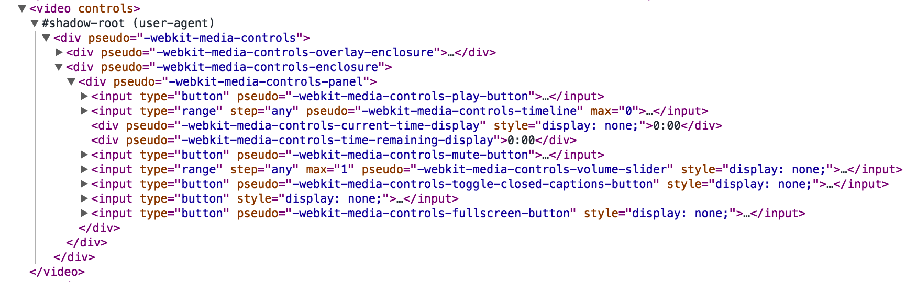

前几天在看YY的讲CardKit的那个slides，在讲前端的组件化和模块化就看到了web components和shadow dom这些东西，于是部分翻译一下这篇文章做个基本了解。

原文是: [A Guide to Web Components](https://css-tricks.com/modular-future-web-components/)


### 啥是web components
简而言之就是可以自定义一个html标签，然后将一堆html和css打包在里面，且包内的元素完全不受包外的影响。

<video controls></video>

比如上面这个`video`标签，将`chrome develop tool->settings->general->elements->show user agent shadow DOM`钩上，然后就可以看见下面这一大坨:



同里我们可以自己来定做一个``标签

### Templates
首先用一个`template`来封装所有的`html`和`css`:

```html
<template>
  <style>
    * {
      -webkit-box-sizing: border-box;
      -moz-box-sizing: border-box;
      -ms-box-sizing: border-box;
      box-sizing: border-box;
    }
    
    #slider {
      max-width: 600px;
      text-align: center;
      margin: 0 auto;
    }
    
    #overflow {
      width: 100%;
      overflow: hidden;
    }
    
    #slides .inner {
      width: 400%;
    }
    
    #slides .inner {
      -webkit-transform: translateZ(0);
      -moz-transform: translateZ(0);
      -o-transform: translateZ(0);
      -ms-transform: translateZ(0);
      transform: translateZ(0);
    
      -webkit-transition: all 800ms cubic-bezier(0.770, 0.000, 0.175, 1.000);
      -moz-transition: all 800ms cubic-bezier(0.770, 0.000, 0.175, 1.000);
      -o-transition: all 800ms cubic-bezier(0.770, 0.000, 0.175, 1.000);
      -ms-transition: all 800ms cubic-bezier(0.770, 0.000, 0.175, 1.000);
      transition: all 800ms cubic-bezier(0.770, 0.000, 0.175, 1.000);
    
      -webkit-transition-timing-function: cubic-bezier(0.770, 0.000, 0.175, 1.000);
      -moz-transition-timing-function: cubic-bezier(0.770, 0.000, 0.175, 1.000);
      -o-transition-timing-function: cubic-bezier(0.770, 0.000, 0.175, 1.000);
      -ms-transition-timing-function: cubic-bezier(0.770, 0.000, 0.175, 1.000);
      transition-timing-function: cubic-bezier(0.770, 0.000, 0.175, 1.000);
    }
    
    #slides img {
      width: 25%;
      float: left;
    }
    
    #slide1:checked ~ #slides .inner {
      margin-left: 0;
    }
    
    #slide2:checked ~ #slides .inner {
      margin-left: -100%;
    }
    
    #slide3:checked ~ #slides .inner {
      margin-left: -200%;
    }
    
    #slide4:checked ~ #slides .inner {
      margin-left: -300%;
    }
    
    input[type="radio"] {
      display: none;
    }
    
    label {
      background: #CCC;
      display: inline-block;
      cursor: pointer;
      width: 10px;
      height: 10px;
      border-radius: 5px;
    }
    
    #slide1:checked ~ label[for="slide1"],
    #slide2:checked ~ label[for="slide2"],
    #slide3:checked ~ label[for="slide3"],
    #slide4:checked ~ label[for="slide4"] {
      background: #333;
    }
  </style>
  <div id="slider">
    <input checked="" type="radio" name="slider" id="slide1" selected="false">
    <input type="radio" name="slider" id="slide2" selected="false">
    <input type="radio" name="slider" id="slide3" selected="false">
    <input type="radio" name="slider" id="slide4" selected="false">
    <div id="slides">
      <div id="overflow">
        <div class="inner">
          
          
          
          
        </div> <!-- .inner -->
      </div> <!-- #overflow -->
    </div>
    <label for="slide1"></label>
    <label for="slide2"></label>
    <label for="slide3"></label>
    <label for="slide4"></label>
  </div>
</template>
```

**template**里的所有元素被浏览器认为是静态的，他们不会被执行或渲染，需用js手动激活

### Shadow DOM
创建shadow DOM很简单，选中一个容器，然后执行`createShadowRoot`即可，这个容器被称为**Shadow Host**，是用户唯一可见的标签。

`createShadowRoot`返回的DOM节点称为**Shadow Root**，任何在**Shadow Root**里的html和css都受**Shadow Boundary**的保护，他们自成一套体系，与外部完全隔离。

现在为我们的`img-slider`创建一个shadow DOM

```html
<div class="img-slider"></div>

<script>
    var tmpl = document.querySelector('template');
    var host = document.querySelector('.img-slider');
    var root = host.createShadowRoot();
    root.appendChild(document.importNode(tmpl.content, true));
</script>
```

### Insertion Points
但上面的template中的图片路径是写死的，要让它可以从用户出入获得，得用`<content>`标签，它用css选择器将shadow host里的元素投影到shadow DOM上，称为**insertion points**。

将template里的四个img修改为content

```html
<template>
    ...
    <div class="inner">
        <content select="img"></content>
    </div>
</template>
```

然后将css也稍作修改

```css
#slides ::content img {
    width: 25%;
    float: left;
}
```

这样图片就可以从用户输入了

```html
<div class="img-slider">
  
  
  
  
</div>
```

### 自定义标签
定义一个自定义标签只需满足两点
1. 名字里要有'-'
2. 继承自`HTMLElement`

修改script内容
```javascript
var tmpl = document.querySelector('template');
var ImgSliderProto = Object.create(HTMLElement.prototype);

ImgSliderProto.createdCallback = function() {
  var root = this.createShadowRoot();
  root.appendChild(document.importNode(tmpl.content, true));
};

var ImgSlider = document.registerElement('img-slider', {
  prototype: ImgSliderProto
});
```
然后就可以直接使用``标签生成slider了
```html

    
    
    
    
</img-slider>
```
最终结果如下（*用Chrome或Opera吧，不然是看不见效果的*）：
<template><style>
\* {
-webkit-box-sizing: border-box;
-moz-box-sizing: border-box;
-ms-box-sizing: border-box;
box-sizing: border-box;}
\#slider {
max-width: 600px;
text-align: center;
margin: 0 auto;}
\#overflow {width: 100%;overflow: hidden;}
\#slides .inner {width: 400%;}
\#slides .inner {
-webkit-transform: translateZ(0);
-moz-transform: translateZ(0);
-o-transform: translateZ(0);
-ms-transform: translateZ(0);
transform: translateZ(0);
-webkit-transition: all 800ms cubic-bezier(0.770, 0.000, 0.175, 1.000);
-moz-transition: all 800ms cubic-bezier(0.770, 0.000, 0.175, 1.000);
-o-transition: all 800ms cubic-bezier(0.770, 0.000, 0.175, 1.000);
-ms-transition: all 800ms cubic-bezier(0.770, 0.000, 0.175, 1.000);
transition: all 800ms cubic-bezier(0.770, 0.000, 0.175, 1.000);
-webkit-transition-timing-function: cubic-bezier(0.770, 0.000, 0.175, 1.000);
-moz-transition-timing-function: cubic-bezier(0.770, 0.000, 0.175, 1.000);
-o-transition-timing-function: cubic-bezier(0.770, 0.000, 0.175, 1.000);
-ms-transition-timing-function: cubic-bezier(0.770, 0.000, 0.175, 1.000);
transition-timing-function: cubic-bezier(0.770, 0.000, 0.175, 1.000);}
\#slides ::content img {width: 25%;float: left;}
\#slide1:checked ~ #slides .inner {margin-left: 0;}
\#slide2:checked ~ #slides .inner {margin-left: -100%;}
\#slide3:checked ~ #slides .inner {margin-left: -200%;}
\#slide4:checked ~ #slides .inner {margin-left: -300%;}
input {display: none;}
label {
background: #CCC;
display: inline-block;
cursor: pointer;
width: 10px;
height: 10px;
border-radius: 5px;
margin-left: 10px;}
\#slide1:checked ~ label[for="slide1"],
\#slide2:checked ~ label[for="slide2"],
\#slide3:checked ~ label[for="slide3"],
\#slide4:checked ~ label[for="slide4"] {background: #333;}</style>
<div id="slider"><input checked="" type="radio" name="slider" id="slide1" selected="false"><input type="radio" name="slider" id="slide2" selected="false"><input type="radio" name="slider" id="slide3" selected="false"><input type="radio" name="slider" id="slide4" selected="false"><div id="slides"><div id="overflow"><div class="inner"><content select="img"></content></div> <!-- .inner --></div> <!-- #overflow --></div><label for="slide1"></label><label for="slide2"></label><label for="slide3"></label><label for="slide4"></label></div>
</template>


</img-slider>
<script>
  var tmpl = document.querySelector('template');
  var ImgSliderProto = Object.create(HTMLElement.prototype);
  
  ImgSliderProto.createdCallback = function() {
    var root = this.createShadowRoot();
    root.appendChild(document.importNode(tmpl.content, true));
  };
  
  var ImgSlider = document.registerElement('img-slider', {
    prototype: ImgSliderProto
  });
</script>

### 最后说下Polymer
Polymer给浏览器加了个新标签`<polymer-element>`，自动将templates转换为shadow DOM然后注册一个自定义标签，省去了自己注册的那一堆js，还有些双向绑定什么的，细节再开一篇吧。

```html
//只用这样写
<polymer-element name="img-slider" noscript>
    <template>
        ... // 之前的那一堆
    </template>
</polymer-element>

// 然后就可以直接用了

    ...
</img-slider>
```

---

一些深入链接，有空再翻吧

[http://w3c.github.io/webcomponents/spec/shadow/](http://w3c.github.io/webcomponents/spec/shadow/)<br/>
[http://www.html5rocks.com/en/tutorials/webcomponents/shadowdom/](http://www.html5rocks.com/en/tutorials/webcomponents/shadowdom/)<br/>
[http://w3c.github.io/webcomponents/spec/custom/](http://w3c.github.io/webcomponents/spec/custom/)<br/>
[http://www.html5rocks.com/en/tutorials/webcomponents/customelements/](http://www.html5rocks.com/en/tutorials/webcomponents/customelements/)<br/>
[http://w3c.github.io/webcomponents/spec/imports/](http://w3c.github.io/webcomponents/spec/imports/)<br/>
[http://www.html5rocks.com/en/tutorials/webcomponents/imports/](http://www.html5rocks.com/en/tutorials/webcomponents/imports/)<br/>

