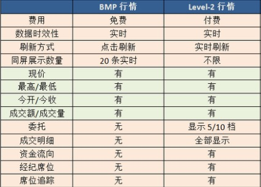

一些行情有关概念的简单备注。

<!-- more -->

## 三大市场

- 港股：港股券商，行情交易的上家都是港交所。
- 美股
- A股

## 股票类型

- 正股
- 指数：一般用来描述某个市场或某个特定的集合总的价格水平变化的指标。通常会选取有代表性的一组股票，把他们的价格进行加权平均，通过一定的计算得到。
- 期货：期货不是货，而是以某种大众产品如棉花、大豆、石油等及金融资产如股票、债券等为标的标准化可交易合约。因此，这个标的物可以是某种商品（例如黄金、原油、农产品），也可以是金融工具。
现货交易中，买方是为了获取商品，卖方为了卖出商品获得价值。而期货交易中，目的可能很多（或者说期货的作用有很多），例如发现标的物的未来价格、回避风险、套期保值、投机。
- 窝轮：港股特有的一种风险极高的衍生品，一般我们认为有认购、认沽、牛证、熊证。特点：收益高、风险大。
- 基金、信托
- 债券
- 一揽子权证
- 板块
- 板块集合

## 行情状态

交易所给的不同行情状态本质是为了收费：

- 一些数据在高的行情状态下可以看到，低的看不到
- 一些数据在高的行情状态下看到的数量多，低的只能看到一部分
- 一些数据在高的行情状态下更新频率快，低的更新频率慢（甚至不会自动更新）



需要注意的是，交易所可能会明确限制不同的权限的授权设备数量和类型，例如A股Level2就规定桌面端和移动端的权限是分开的，即用户需要分别购买桌面端和移动端的Level2才能在桌面端和移动端都使用Level2，只买了桌面端的权限就只能在桌面端使用；券商也可能根据自己的策略制定一些限制，例如你的号码买了港股Level2权限，但只能同时在一台设备上使用Level2，假如先在手机端登录了该账号（该账号立刻进入Level2状态），后又在桌面端登录了该账号，那么前面在手机登录的就会被踢为BMP状态。

## 市场状态和时段

### 港股

#### 港股市场状态

竞价交易阶段->等待开盘->早盘->午间休市->午盘->已收盘->盘后竞价

#### 港股交易时间:

早盘9:30-12:00、午间休市12:00-13:00、午盘13:00-16:00

#### 竞价、竞价限价

开盘前的半小时（9:00-9:30）这半个小时称为盘前竞价时段，又可以按照划分为若干时间段：
- 9:00-9:15 输入买卖盘时段，允许挂竞价单（只指定数量不指定价格）、竞价限价单（既指定数量又指定价格）
- 9:15-9:20 对盘前时段，停止挂竞价限价单，只允许挂竞价单
- 9:20-9:28 对盘后时段，系统不接受任何挂单，开始按顺序撮合成交
- 9:28-9:30 等待开盘，停止一切活动
通过竞价、竞价限价两种方式，在看盘前根据买卖盘撮合成交，定出开盘价。

#### 盘后竞价

收盘后(16:00-16:10)，通过竞价、竞价限价进行交易

### 美股

#### 美股市场状态
未开盘->盘前开始->盘前结束->盘中->盘后开始->盘后结束->已收盘

#### 美股交易时间
美国东部时间上午9:30-下午4:00，午间不休市。
冬令时，相当于北京时间晚上22:30至次日凌晨5:00。
夏令时：相当于北京时间晚上21:30至次日凌晨4:00。
如果加入盘前盘后交易，那么则是美国东部时间上午7:30开盘，晚上8:30收盘。
另外，美股的股指期货比如小型标普指数、小型道琼斯工业指数等是24小时交易的，中间只有几段很短的休盘时间。

## 常用数据、指标

### 常用数据
- 当前价: 即按盘价。若一只股票在持续交易时段内或交易结束前有成交，按盘价一般为最后记录的成交价；但若这只股票在当日的交易时段内没有成交，按盘价是根据委托买盘价、委托卖盘价或上个交易日的收市价来进行计算
- 昨收价
- 开盘价
- 最高价、最低价
- 涨跌额
- 涨跌幅
- 成交量：某一只股票在一定时间内的成交量的总和（单位为手）
- 成交额：某一只股票在一定时间内的成交金额总和
- 换手率：也称为周转率，指一定时间内市场中股票转手买卖的频率，是反映股票流通性强弱的指标之一，一般认为在3%以上的算成交活跃。在流通股份数量相同的前提下，平均换手率高的个股的流动性更好，更容易以较合理的价格、较快的速度变现。计算方公式：(某一段时期内的成交量)/(发行总股数)x100%。
- 振幅：根据不同的计算周期，有日振幅分析、周振幅分析、月振幅分析等等类型。例如日振幅，算法：(|当天开盘后的最高价-最低价之间|) /前日收盘价x100%，它在一定程度上表现股票的活跃程度。
- 量比：量比是衡量相对成交量的指标。它是开市后每分钟的平均成交量与过去5个交易日每分钟平均成交量之比。计算公式:量比=现成交总手/〖(过去5个交易日平均每分钟成交量)×当日累计开市时间(分)〗当量比大于1时，说明当日每分钟的平均成交量大于过去5日的平均值，交易比过去5日火爆；当量比小于1时，说明当日成交量小于过去5日的平均水平。
- 委比：委比=(委托买入手数－委托卖出手数)/(委托买入手数+委托卖出手数)×100%。取值范围-100%到+100%，+100%表示全部的委托均是买盘，涨停的股票的委比一般是100%，而跌停是-100%。当委比值为-100时，它表示只有卖盘而没有买盘，说明市场的抛盘非常大；当委比值为+100时，它表示只有买盘而没有卖盘，说明市场的买盘非常有力。
- 市盈率：股票现价/每股盈利。通常用来作为比较不同价格的股票是否被高估或者低估的指标。
- 每手：交易的基本单位，一般是1手=N股。不同的市场换算不同，A股1手=100股；港股不确定，例如腾讯1手=100股，金山1手=1000股；美股1手=1股。
- 市值：上市公司的发行股份按市场价格计算出来的股票总价值。算法：每股的市场价格x发行总股数
- 流通市值：流通市值=流通总股数*每股的市场价格。是否流通是关键，A股上市的企业的股票有些是有限制的，不能在交易所交易（或在一定时间内不能交易），这种就是非流通股
- 52周最高最低：一年最高最低价
- 历史最高最低
- 上升数：用于港股指数，指影响该指数的成分股（例如恒生指数的成分股有49只）当天上涨的数目
- 平盘数：参考上升数
- 下跌数：参考上升数
- 高水、低水：高水又称升水,通常是指期货价格高於现货价格.以期指（即恒指期货）为例,如果期指高於恒指（即恒生指数）,便称为期指高水.如果期指出现高水,一般会认为是后市向好的指标,因为期货市场的投资者愿意以较现货市场为高的价格去购买期指,表示投资者对后市有信心。
- 涨停价、跌停价：A股市场当日涨跌幅的限制，即每个交易日上涨（下跌）幅度达到N时，交易所就不再允许以高于（低于）涨停价、跌停价的价格成交。一般当日发行的股不受该限制。st的为5%，其他一般为10%
- 内盘、外盘：内盘-以买一或更低的价格主动卖出；外盘-以卖一或更高的价格主动买入
- 盘前、盘后

### 分时、K线指标

```
VOL
MACD
KDJ
ARBR
CR
DMA
EMV
RSI
MA
BOLL
EMA
SAR
```

### 逐笔

```
‘X’ - 碎股成交+人工成交+经纪内部直接成交
‘M’ - 碎股成交+人工成交+跨经纪成交
‘D’ - 碎股成交
‘*’ - 已取消的成交
‘ ‘ - 自动对盘成交+跨经纪的成交
‘Y’ - 自动对盘成交+经纪内部直接成交
‘P’ - 开盘前成交+跨经纪成交
‘U’ - 竞价成交
‘↑’ - 外盘-以卖一或更高的价格主动买入
‘↓’ - 内盘-以买一或更低的价格主动卖出
‘♦’ - 中性盘，以买一价与卖一价之间撮合成交
```

目前手机端简单处理，只根据成交价区分了外盘、内盘、中性盘
通过逐笔可以从整体上看出个股在当前交易日的活跃程度，也可以得知每一笔成交的明细。最重要的是内外盘，它直接反映出该股票当前及未来一小段时间被市场选择的情况（或者说买卖双方买入卖出意愿的强烈程度）


### 买卖档

逐笔是反映了已经成交的单的情况，而买卖档反映了等待成交的单的情况。
交易所是根据客户挂的买单、卖单按照价格撮合成交。买卖档就是这些挂单根据买入卖出形成的两个队列，在队列中未成交的最低卖价就是卖一，未成交的最高买价就是买一，其余类推。从买卖档中可以看到当前买卖两个方向操作者的意愿和排队等待情况，如果想立刻买入，可以挂大于等于卖1的价格单，如果想立刻卖出，可以挂小于等于买1的价格单。
不同市场不同行情状态下的买卖档数不同，一般有1档、5档、10档，每一档可以看到价格、该价格的总委托量、该价格的总委托数

### 经纪队列

可以大致判断出自己挂单目前在队列中的位置，方便决策是否要修改价格

### 资金流向

- 价格角度：通过价格变化反推资金流向。股价处于上升状态时产生的成交额是推动股价上涨的力量，这部分成交额被定义为资金流入；股价处于下跌状态时产生的的成交额是推动股价下跌的力量，这部分成交额被定义为资金流出；当天两者的差额即是当天两种力量相抵之后剩下的推动股价上升的净力，定义为当天的资金净流入。
- 外盘内盘角度：将内盘、外盘、中性盘的量在交易时间上累积，主动性买盘以及中性盘之和，视为资金流入，将主动性卖盘视为资金流出。

### 成交分布

根据历史成交数据将逐笔成交记录划分成大单、中单、小单。以正股前一个月（或窝轮前三天）的平均每笔成交量为参考值，小于该平均值为小单，大于等于该金额的10倍为大单，其余为中单
