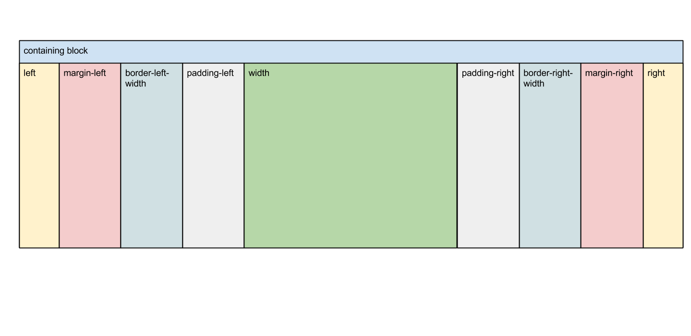

### 弹性盒模型box相关

CSS的标准盒模型如下，CSS3中新增了一些弹性盒模型机制用于处理元素在盒子中的分布方式。

要使用弹性盒模型相关属性需将最外层`div`的`display`设为`box`，并添加相应的浏览器支持。

    .wrapper {
        display: box;
        display: -moz-box;
        display: -web-kit-box;
        /*其他box属性*/
    }

#### box-orient 子元素布局方向 .wrapper
- horizontal: 从左到右水平显示
- vertical: 从上至下垂直显示
- inline-axis: 沿着内联轴显示
- block-axis: 沿着块轴显示

> 

    

    

    

 

    

    

    

#### box-direction 子元素整体显示顺序 .wrapper
- normal: 正常顺序
- reverse: 反向显示
- inherit: 继承上级

#### box-ordinal-group 子元素单个具体显示顺序 .box
- &lt;integer>: 从1开始的位置序号

>

    
first

    
second

    
third

#### box-flex 按比例占满弹性空间 .box
- &lt;number>: 整数或小数，分母是所有有box-flex的属性值相加，box-flex只有当子元素有确定width和height时才可被正确解析

>

    
first

    
second

    
third

#### box-pack 在水平方向上对盒子的富余空间进行管理 .wrapper
- start: 子元素在左，富余空间在右
- end: 子元素在右，富余空间在左
- justify: 富余空间在子元素中间平均分配
- center: 富余空间在子元素两侧平均分配

>

    
start

    
start

    
start

 

    
end

    
end

    
end

 

    
justify

    
justify

    
justify

 

    
center

    
center

    
center

#### box-align 在垂直方向上对盒子的富余空间进行管理 .wrapper
- start: 子元素在上，富余空间在下
- end: 子元素在下，富余空间在上
- center: 富余空间在子元素上下平均分配
- baseline: 子元素沿着基线，富余空间可前可后
- stretch: .box高度被拉到与.wrapper相等

**注：box-pack与box-align是相对于box-orient而言的**

>

    

        
start

    

    

        
end

    

    

        
center

    

    

        
baseline

    

    

        
stretch

    

#### box-lines 溢出空间管理 .wrapper
- single: 所有子元素都单行或单列
- multiple: 所有子元素都多行或多列

**还没有被任何浏览器实现**

#### box-sizing 定义盒模型解析模式
- content-box: width = border + padding + content
- border-box: width = content
- inherit: 同上级

### 多列布局columns相关 .wrapper

#### columns  (webkit)
- column-width column-count: 每列宽度 列数

#### column-count (moz webkit)
- &ltinteger>: 列数
- auto: 自动设置

#### column-width (moz webkit)
- &lt;length>: 宽度
- auto: 自动设置

#### column-gap 列间距 (moz webkit)
- normal: 浏览器默认设置,1em
- &lt;length>: 自定义值，不可为负

#### column-rule 边框样式 (moz webkit)
- length style color transparent: 间距 样式 颜色 是否透明
    - style: none hidden dotted dashed solid double groove ridge inset outset
    - transparent: true false

#### column-span 定义跨列显示 (webkit)
- 1: 只在本列显示
- all: 横跨所有列

#### column-fill 定义栏目高度 (webkit)
- auto: 各列高度随内容变化
- balance: 各列高度同内容最多的那一列
